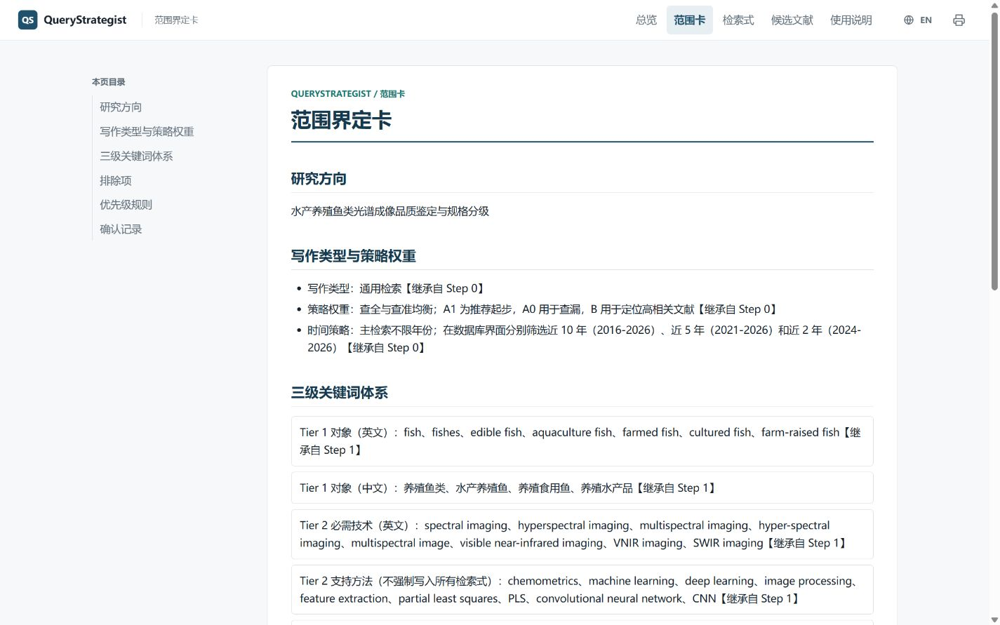
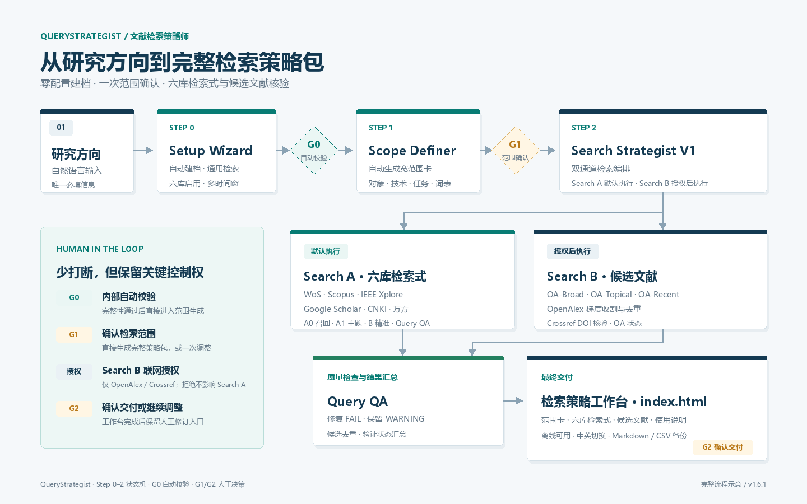
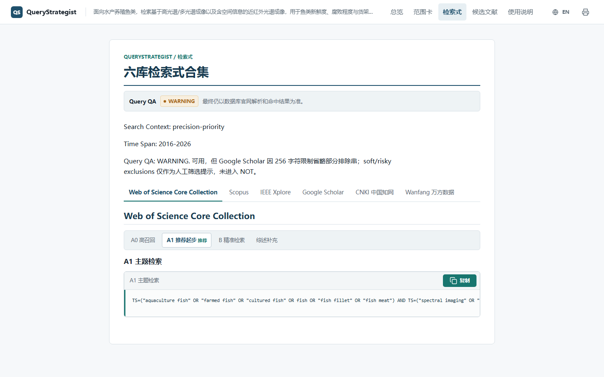
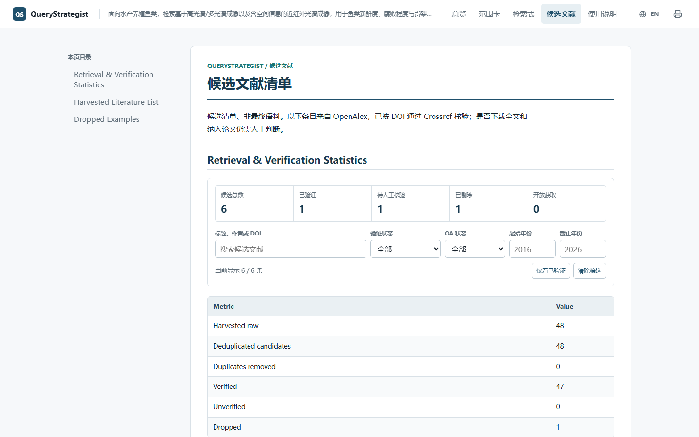

# QueryStrategist: An LLM-Powered Literature Search Skill

> Turn a natural-language research direction into reusable, checkable, and traceable academic search strategies for six major databases.

> [中文说明](README.zh-CN.md)

> **Version**: v1.6.3 (2026-08-24)

QueryStrategist is an interactive **AI agent skill for literature search, scholarly information retrieval, and research workflow support**. It uses LLM semantic understanding to structure a research idea, generate platform-specific queries, and optionally collect candidate metadata through OpenAlex and Crossref.



*The generated workbench brings the scope card, six-database queries, candidate literature, and usage guide together under a single `index.html` entry point.*

## What Problem Does It Solve?

The first stage of a review, paper, thesis, proposal, or grant application often involves three recurring problems:

1. A research idea is expressed in natural language, but its objects, technologies, tasks, and boundaries have not yet been converted into searchable concepts.
2. Web of Science, Scopus, IEEE Xplore, Google Scholar, CNKI, and Wanfang use different query conventions, so the same strategy must be rewritten repeatedly.
3. Candidate literature is difficult to organize and audit when search terms, sources, DOI checks, and open-access status are scattered across notes and chat messages.

QueryStrategist addresses this starting point with a human-in-the-loop workflow. The LLM handles configuration defaults, concept structuring, query generation, and optional metadata harvesting. The researcher keeps control over scope confirmation, literature decisions, and final use of the results.

## Overview

The root `SKILL.md` orchestrates three sequential steps:

| Step | Sub-Skill | Main output | Responsibility |
|:--:|:--|:--|:--|
| 0 | Setup Wizard | Project profile, six-database defaults, automatic G0 validation | AI-led |
| 1 | Scope Definer | Scope card and three-tier keyword system | Human + AI |
| 2 | Search Strategist V1 | Six-database queries and optional API harvesting | AI-led |

The final output is a **search strategy pack** consisting of a scope card, a multi-platform query pack, a candidate literature list, and a usage guide.



*G1 and G2 preserve researcher control. G0 is an internal validation step. Search B requests network consent before accessing OpenAlex and Crossref.*

## Core Design

### 1. Structured intent-to-query conversion

Scope Definer turns a vague research direction into:

- Tier 1: research objects;
- Tier 2: required technical anchors and supporting methods;
- Tier 3: research tasks and indicators;
- Chinese and English keyword sets;
- strong, soft, and risky exclusions;
- writing-type and precision/recall priorities.

Broad exclusions are downgraded to screening suggestions instead of being mechanically inserted into `NOT`, reducing the risk of removing relevant literature.

### 2. Strategy weights by writing type

Review-oriented work prioritizes recall. Research articles prioritize precision. Proposals and grant applications balance coverage and novelty. These settings affect query variants and candidate-list ordering without changing the researcher's explicit inputs.

### 3. Two search channels

- **Search A** generates copyable queries for all six databases and does not require API access.
- **Search B** optionally harvests metadata from OpenAlex and validates DOI records against Crossref after explicit user consent.

Refusing network access skips Search B only. Search A and the strategy pack remain available.

### 4. Query QA and API safeguards

Query QA checks parentheses, quotation marks, platform fields, Google Scholar length, IEEE clause length, exclusion risks, required technical anchors, and accidental `review-only` restrictions. Results are classified as `PASS`, `WARNING`, or `FAIL`; a `FAIL` blocks delivery until fixed.

The harvester also includes per-endpoint request budgets, response caching, dry-run support, 429 circuit breaking, bounded `Retry-After` waits, and failure statistics.

## The Search Query Levels

Each database receives layered query variants:

| Level | Purpose | Recommended use |
| --- | --- | --- |
| A0 recall baseline | Research object + required technology | First exploration and coverage check |
| A1 topic query | Adds research tasks and topic terms | Stable topic-focused retrieval |
| B precision query | Uses platform-specific fields or tighter constraints | Core-literature screening |

Use the sequence `A0 → A1 → B`. Starting with the strictest query can hide useful terminology and make zero-result problems harder to diagnose. For IEEE Xplore, validate the broad A0 query first, then add conditions gradually.



## Optional Candidate-Literature Harvesting

Before Search B begins, QueryStrategist requests one explicit authorization:

> The next step will harvest candidate literature through OpenAlex and verify DOI records one by one through Crossref. It will access the HTTPS APIs at `api.openalex.org` and `api.crossref.org`, download no full text, and submit no personal information. Allow this operation?

The default process uses two to three controlled OpenAlex queries. Results are merged and deduplicated by DOI, or by title and year when DOI is unavailable. Only unique records with DOI values are sent to Crossref for validation.

The candidate list includes title, authors, venue, year, DOI, source, verification status, and open-access status.



The harvested metadata is a **candidate reference list, not a trusted corpus**. Researchers must verify the actual paper, download full text themselves, and decide whether a paper should be included.

## Deliverables

After completion, open `index.html` first. It links the four core deliverables:

1. **Scope card**: research objects, technologies, tasks, keywords, exclusions, and strategy priorities.
2. **Query pack**: A0, A1, and B queries for Web of Science, Scopus, IEEE Xplore, Google Scholar, CNKI, and Wanfang.
3. **Candidate literature list**: deduplicated metadata, DOI links, source labels, verification results, and OA status.
4. **Usage guide**: where to paste each query, expected result patterns, and ways to broaden or narrow a search.

Markdown, CSV, and JSON exports remain available for editing, archiving, and downstream processing. The generated HTML pages work offline and provide a Chinese/English interface toggle. Query strings, keywords, exclusions, paper titles, authors, venues, and DOI values remain unchanged when the interface language changes.

## Quick Start

Install the complete project directory, then send:

```text
Start QueryStrategist
```

Or provide the research direction directly:

```text
Start QueryStrategist. My research direction is: deep learning for medical image segmentation
```

To generate only the six-database queries without API harvesting:

```text
Only start Search A and generate six-database queries for: spectral imaging for quality assessment and size grading of farmed fish
```

For a full run, the system uses documented defaults and asks only for the key scope confirmation. Explicit user input always overrides defaults. The final pack is saved to `projects/<active_project_id>/deliverables/` unless the user provides another path.

## Repository Structure

```text
QueryStrategist/
├── LICENSE                                  # MIT
├── VERSION                                  # Current release version
├── BUILD_MANIFEST.json                      # Release integrity manifest
├── README.md                                # English documentation (default)
├── README.zh-CN.md                          # Chinese documentation
├── img/                                     # Documentation images
├── RUN.md                                   # Runtime entry points and code inventory
├── SKILL.md                                 # Main Skill and state-machine orchestrator
├── setup_wizard/                            # Step 0
├── scope_definer/                           # Step 1
├── search_strategist_v1/                    # Step 2 and pack template
├── query_crafter/                           # Six-platform query controller
├── wos_query_crafter/                       # Web of Science
├── scopus_query_crafter/                    # Scopus
├── ieee_query_crafter/                      # IEEE Xplore
├── google_scholar_query_crafter/            # Google Scholar
├── cnki_query_crafter/                      # CNKI
├── wanfang_query_crafter/                   # Wanfang
├── literature_harvester/                    # OpenAlex harvesting and Crossref validation
└── _shared_tools/                           # Rendering and validation scripts
```

`E:\QueryStrategist` is the formal GitHub repository and public image source. The SCP release package is maintained at the same version and references the repository's Raw images. The release package does not include tests, test data, or Python caches.

## Tools, Dependencies, and Data Boundaries

| Tool or service | Use | License or terms |
|---|---|---|
| Built-in LLM Agent | Workflow reasoning and generation | — |
| openpyxl | Structured exports | MIT |
| OpenAlex API | Candidate metadata harvesting | Service terms |
| Crossref REST API | DOI verification | Service terms |
| SCImago SJR data | Curated journal quartile mapping | CC BY-NC 4.0; not distributed |

The project does not distribute the SJR dataset. External services remain subject to their own terms of use.

## Limitations

- API harvesting is not full-text collection and does not create a literature corpus.
- Query hit counts are estimates; each query must be validated on the target database website.
- AI does not decide literature inclusion or replace expert review.
- OpenAlex and Crossref metadata must be checked before academic use.
- Automatic validation does not replace testing the final queries in Web of Science, Scopus, IEEE Xplore, Google Scholar, CNKI, and Wanfang.

## License

The QueryStrategist Skill source code is released under the [MIT License](LICENSE). External dependencies, APIs, and datasets follow their respective licenses and service terms.

## Links

- **SCP Skill page**: <https://discovery.intern-ai.org.cn/scp/skill/642>
- **GitHub repository**: <https://github.com/2025247378/QueryStrategist>
